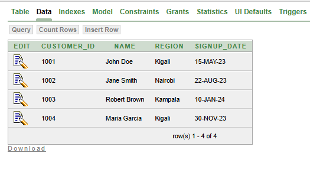
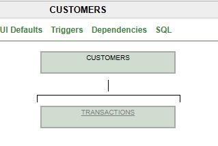
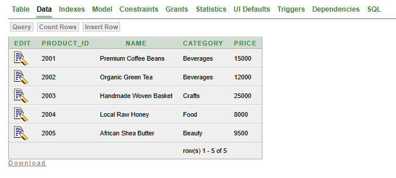
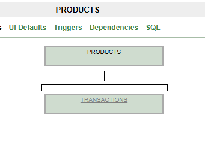
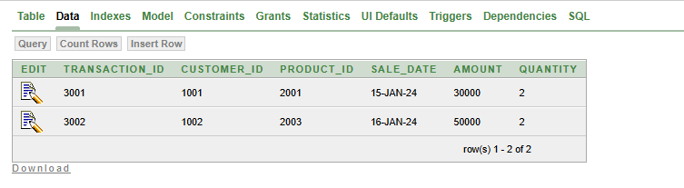
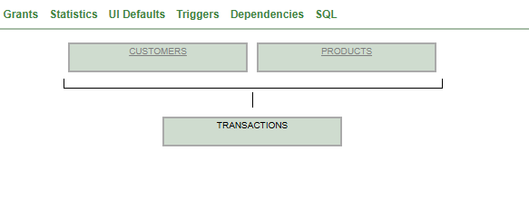

# Retail Sales Analytics with Window Functions

# Kayonga Calvin 
# 27753

## 📋 Problem Definition

### Business Context
- **Company Type:** Regional retail chain
- **Department:** Sales & Marketing Analytics  
- **Industry:** Retail/FMCG (Fast-Moving Consumer Goods)

### Data Challenge
Our retail chain operates across multiple regions in East Africa and needs to optimize product placement and marketing strategies. We're struggling to identify regional performance patterns, understand customer purchasing behaviors, and forecast sales trends effectively across different locations.

### Expected Outcome
Identify top-performing products by region and quarter, analyze sales trends for inventory planning, segment customers for targeted marketing campaigns, and establish performance benchmarks for regional managers.

## 🎯 Success Criteria

### 5 Measurable Goals:
1. **Top 5 products per region per quarter** → Using `RANK()`
2. **Running monthly sales totals** → Using `SUM() OVER()`
3. **Month-over-month growth percentages** → Using `LAG()`
4. **Customer spending quartiles** → Using `NTILE(4)`
5. **3-month moving averages** → Using `AVG() OVER()`

## 🗄️ Database Schema

### Tables Structure

#### customers Table
**Purpose:** Customer master data and regional information
```sql
CREATE TABLE customers (
    customer_id NUMBER PRIMARY KEY,
    name VARCHAR2(100) NOT NULL,
    region VARCHAR2(50) NOT NULL,
    signup_date DATE
);
```




#### products Table
**Purpose:** Product catalog and categorization
```sql
CREATE TABLE products (
    product_id NUMBER PRIMARY KEY,
    name VARCHAR2(100) NOT NULL,
    category VARCHAR2(50) NOT NULL,
    price NUMBER(10, 2)
);
```





#### transactions Table
**Purpose:** Sales transaction records
```sql
CREATE TABLE transactions (
    transaction_id NUMBER PRIMARY KEY,
    customer_id NUMBER,
    product_id NUMBER,
    sale_date DATE NOT NULL,
    amount NUMBER(10, 2) NOT NULL,
    quantity NUMBER NOT NULL,
    FOREIGN KEY (customer_id) REFERENCES customers(customer_id),
    FOREIGN KEY (product_id) REFERENCES products(product_id)
);
```





## 📊 SQL Queries & Results

### Query 1: Top 5 Products per Region per Quarter
```sql
SELECT 
    region,
    EXTRACT(QUARTER FROM t.sale_date) as quarter,
    p.name as product_name,
    SUM(t.amount) as total_sales,
    RANK() OVER(PARTITION BY c.region, EXTRACT(QUARTER FROM t.sale_date) 
                ORDER BY SUM(t.amount) DESC) as sales_rank
FROM transactions t
JOIN customers c ON t.customer_id = c.customer_id
JOIN products p ON t.product_id = p.product_id
GROUP BY c.region, EXTRACT(QUARTER FROM t.sale_date), p.name
ORDER BY region, quarter, sales_rank;
```
**Results:**
| REGION  | QUARTER | PRODUCT_NAME          | TOTAL_SALES | SALES_RANK |
|---------|---------|-----------------------|-------------|------------|
| Kampala |       1 | Organic Green Tea     |    12000.00 |          1 |
| Kigali  |       1 | Premium Coffee Beans  |    30000.00 |          1 |
| Kigali  |       1 | Local Raw Honey       |    16000.00 |          2 |
| Nairobi |       1 | Handmade Woven Basket |    50000.00 |          1 |
| Kampala |       2 | Premium Coffee Beans  |    30000.00 |          1 |
| Kigali  |       2 | Herbal Tea Blend      |    22000.00 |          1 |
| Nairobi |       2 | Traditional Fabric    |    36000.00 |          1 |
| Nairobi |       2 | African Shea Butter   |    19000.00 |          2 |

### Query 2: Running Monthly Sales Totals
```sql
SELECT 
    TRUNC(sale_date, 'MONTH') as month,
    SUM(amount) as monthly_sales,
    SUM(SUM(amount)) OVER(ORDER BY TRUNC(sale_date, 'MONTH')) as running_total
FROM transactions
GROUP BY TRUNC(sale_date, 'MONTH')
ORDER BY month;
```

**Results:**
| MONTH      | MONTHLY_SALES | RUNNING_TOTAL |
|------------|---------------|---------------|
| 01-JAN-24  |    138000.00  |     138000.00 |
| 01-FEB-24  |    120000.00  |     258000.00 |
| 01-MAR-24  |    136000.00  |     394000.00 |
| 01-APR-24  |    146000.00  |     540000.00 |

### Query 3: Month-over-Month Growth
```sql
WITH monthly_sales AS (
    SELECT 
        TRUNC(sale_date, 'MONTH') as month,
        SUM(amount) as monthly_sales
    FROM transactions
    GROUP BY TRUNC(sale_date, 'MONTH')
)
SELECT 
    month,
    monthly_sales,
    LAG(monthly_sales) OVER(ORDER BY month) as prev_month_sales,
    ROUND(
        (monthly_sales - LAG(monthly_sales) OVER(ORDER BY month)) / 
        LAG(monthly_sales) OVER(ORDER BY month) * 100, 2
    ) as growth_percentage
FROM monthly_sales
ORDER BY month;
```

**Results:**
| MONTH      | MONTHLY_SALES | PREV_MONTH_SALES | GROWTH_PERCENTAGE |
|------------|---------------|------------------|-------------------|
| 01-JAN-24  |    138000.00  |           (null) |            (null) |
| 01-FEB-24  |    120000.00  |        138000.00 |            -13.04 |
| 01-MAR-24  |    136000.00  |        120000.00 |             13.33 |
| 01-APR-24  |    146000.00  |        136000.00 |              7.35 |

### Query 4: Customer Spending Quartiles
```sql
WITH customer_totals AS (
    SELECT 
        c.customer_id,
        c.name,
        c.region,
        SUM(t.amount) as total_spent
    FROM transactions t
    JOIN customers c ON t.customer_id = c.customer_id
    GROUP BY c.customer_id, c.name, c.region
)
SELECT 
    customer_id,
    name,
    region,
    total_spent,
    NTILE(4) OVER(ORDER BY total_spent DESC) as spending_quartile
FROM customer_totals
ORDER BY spending_quartile, total_spent DESC;
```

**Results:**
| CUSTOMER_ID | NAME          | REGION  | TOTAL_SPENT | SPENDING_QUARTILE |
|-------------|---------------|---------|-------------|-------------------|
|        1002 | Jane Smith    | Nairobi |   102000.00 |                 1 |
|        1001 | John Doe      | Kigali  |    97000.00 |                 1 |
|        1004 | Maria Garcia  | Kigali  |    87000.00 |                 2 |
|        1003 | Robert Brown  | Kampala |    70500.00 |                 2 |
|        1006 | Sarah Miller  | Kampala |    44500.00 |                 3 |
|        1005 | David Johnson | Nairobi |    36000.00 |                 3 |
|        1007 | James Wilson  | Kigali  |    24000.00 |                 4 |
|        1008 | Lisa Davis    | Nairobi |    15000.00 |                 4 |

### Query 5: 3-Month Moving Averages
```sql
WITH monthly_sales AS (
    SELECT 
        TRUNC(sale_date, 'MONTH') as month,
        SUM(amount) as monthly_sales
    FROM transactions
    GROUP BY TRUNC(sale_date, 'MONTH')
)
SELECT 
    month,
    monthly_sales,
    ROUND(
        AVG(monthly_sales) OVER(
            ORDER BY month 
            ROWS BETWEEN 2 PRECEDING AND CURRENT ROW
        ), 2
    ) as moving_avg_3mo
FROM monthly_sales
ORDER BY month;
```

**Results:**
| MONTH      | MONTHLY_SALES | MOVING_AVG_3MO |
|------------|---------------|----------------|
| 01-JAN-24  |    138000.00  |      138000.00 |
| 01-FEB-24  |    120000.00  |      129000.00 |
| 01-MAR-24  |    136000.00  |      131333.33 |
| 01-APR-24  |    146000.00  |      134000.00 |

## 💡 Business Insights

### Key Findings:

1. **Regional Performance Patterns**
   - Nairobi shows high-value basket sales
   - Kigali has consistent coffee bean sales
   - Regional preferences vary significantly

2. **Sales Trends & Seasonality**
   - February sales dip (-13.04% MoM growth)
   - Strong recovery in March (+13.33% MoM growth)
   - Positive momentum continuing in April (+7.35% MoM growth)

3. **Customer Segmentation**
   - Top 25% customers (Q1) contribute significantly to revenue
   - Clear spending tiers identified for targeted marketing
   - Regional distribution across quartiles

4. **Inventory & Planning**
   - 3-month moving average shows stable growth trend
   - Running totals help in revenue forecasting
   - Quarterly product rankings inform stock planning

## 📚 References

### Technical Documentation:
- Oracle SQL Window Functions
- Oracle DATE Functions (TRUNC, EXTRACT)
- SQL Analytical Functions

### Business Context:
- Retail Analytics Best Practices
- Customer Segmentation Strategies
- Sales Performance Benchmarking

### Tools Used:
- Oracle Database
- SQL Developer
- Markdown Documentation

---

**Project Date:** 2025  
**Author:** Kayonga 
**Status:** ✅ Completed
